简体中文 | [English](./README.md)

### Ⅰ. 进击的坦克（The Fight of Tanks）

- [zfoo](https://github.com/zfoo-project/zfoo)框架的游戏服务器的演示项目
- 单服运行代码和分布式运行的代码几乎一致
- 上能写游戏，下能写网站，单服，分布式，网关，异步调用无所不能，所以叫万能的RPC框架

### Ⅱ. 环境要求

- 后端依赖 [zfoo](https://github.com/zfoo-project/zfoo) ，运行前先使用Maven
  install [zfoo](https://github.com/zfoo-project/zfoo)
  前端依赖 [lux-admin-vuetify3](https://github.com/yangjiakai/lux-admin-vuetify3)，目标创造最优秀的 vuetify3 的 Admin 开源模板
- JDK 17+
- MongoDB 4+
- Zookeeper 3.6+

### Ⅲ. 本地单服运行

- [admin](./admin/src/test/java/com/zfoo/tank/admin/ApplicationTest.java)为web资源服务器提供游戏入口和后台管理系统
- [single](./single/src/test/java/com/zfoo/tank/single/ApplicationTest.java)为单服游戏服务器，single-boot是用了spring boot自动化配置的single，代码一致
- 本地运行从test下运行，原因看[FAQ](https://github.com/zfoo-project/zfoo/blob/main/doc/FAQ.md) ，实在有问题可以看看手把手的
  [zfoo 框架视频教程](https://github.com/zfoo-project/zfoo/blob/main/doc/video-tutorial.md)

```
1. 在浏览器中运行游戏使用websocket的服务器启动入口，即ApplicationTest.startWebsocketApplication()
2. 在untiy种运行使用tcp的服务器启动入口，即ApplicationTest.startApplication()

本地游戏入口，http://localhost:9600/game/index.html
本地后台管理入口，http://localhost:9600/
```

### Ⅳ. 本地分布式运行

- [admin](./admin/src/test/java/com/zfoo/tank/admin/ApplicationTest.java)为web资源服务器提供游戏入口和后台管理系统
- [gateway](./gateway/src/test/java/com/zfoo/tank/gateway/ApplicationTest.java)网关
- [cache](./cache/src/test/java/com/zfoo/tank/cache/ApplicationTest.java)提供缓存服务
- [home](./home/src/test/java/com/zfoo/tank/cache/ApplicationTest.java)提供基本业务逻辑服务
- 本地运行从test下运行，原因看[FAQ](https://github.com/zfoo-project/zfoo/blob/main/doc/FAQ.md) ，实在有问题可以看看手把手的
  [zfoo 框架视频教程](https://github.com/zfoo-project/zfoo/blob/main/doc/video-tutorial.md)

```
本地游戏入口，http://localhost:9600/game/index.html
本地后台入口，http://localhost:9600/
```

### Ⅴ. 部署运行

- 具体可参考视频教程
- 游戏入口 [tank.zfoo.net](http://tank.zfoo.net)
- 后台管理 [tank-admin.zfoo.net](http://tank-admin.zfoo.net)

```
单服部署命令：
sh /deploy.sh stopUpdateStart /usr/local/tank/admin/admin-1.0.jar /usr/local/tank/admin
sh /deploy.sh stopUpdateStart /usr/local/tank/single/single-1.0.jar /usr/local/tank/single


分布式部署命令
sh /deploy.sh stopUpdateStart /usr/local/tank/admin/admin-1.0.jar /usr/local/tank/admin
sh /deploy.sh stopUpdateStart /usr/local/tank/cache/cache-1.0.jar /usr/local/tank/cache
sh /deploy.sh stopUpdateStart /usr/local/tank/gateway/gateway-1.0.jar /usr/local/tank/gateway
sh /deploy.sh stopUpdateStart /usr/local/tank/home/home-1.0.jar /usr/local/tank/home
```

### Ⅵ. 游戏截图

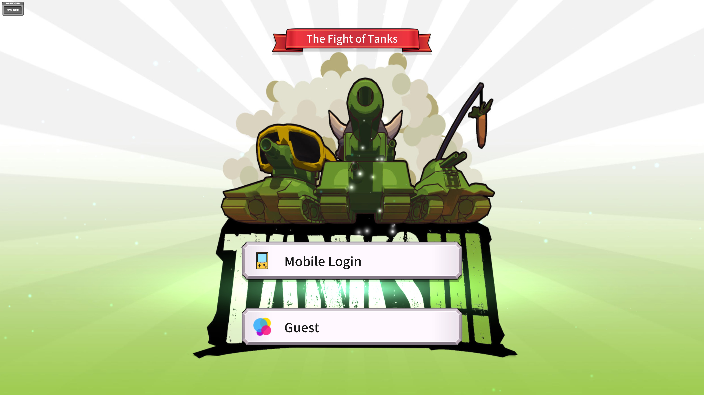
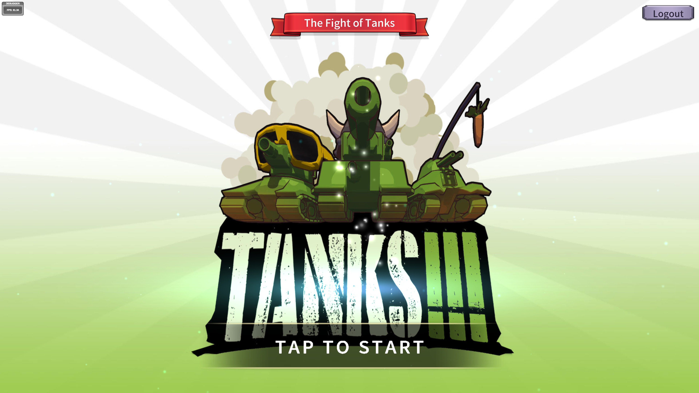
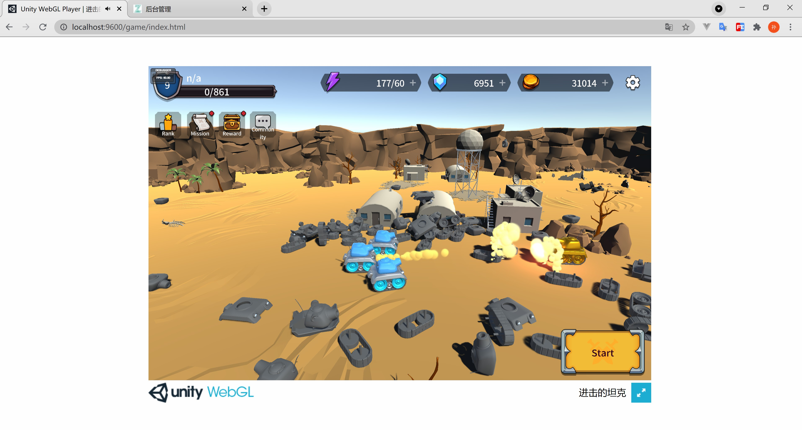
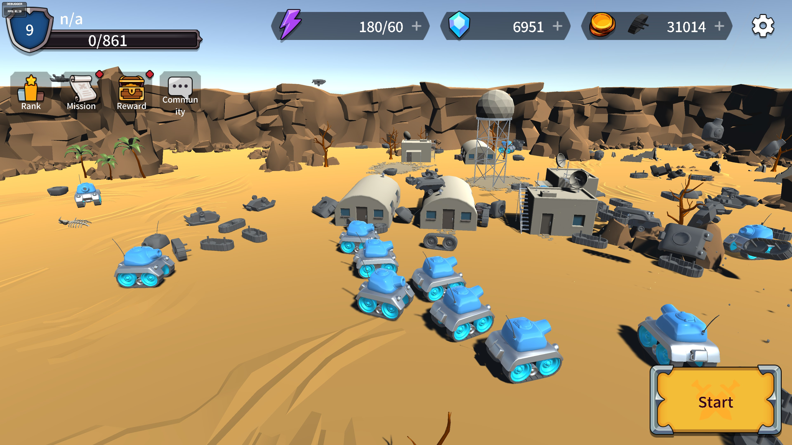
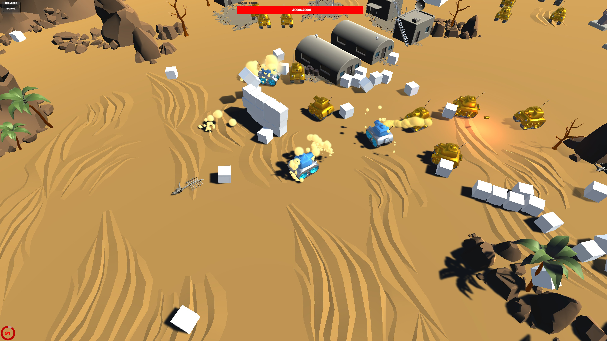
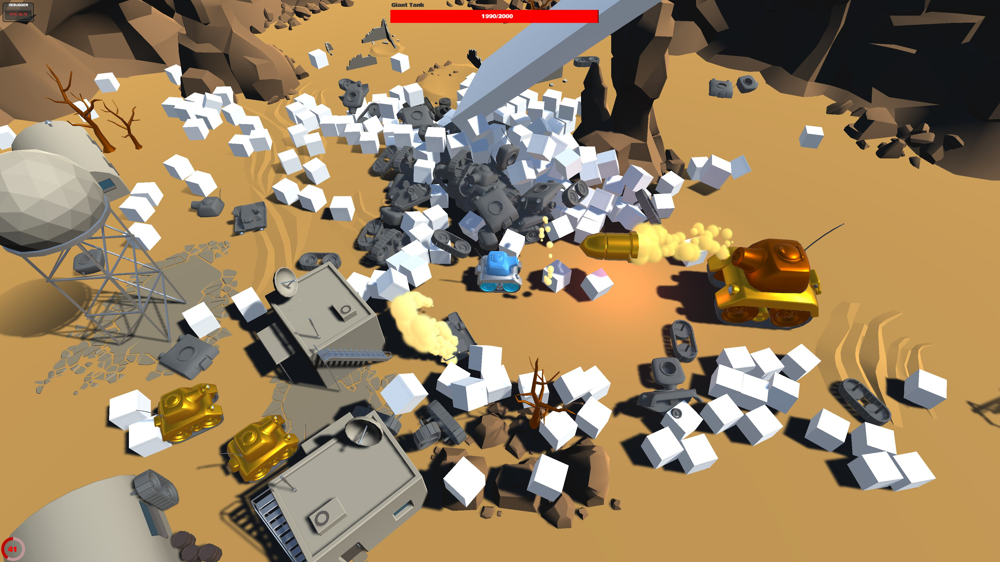

### Ⅵ. 后台系统截图

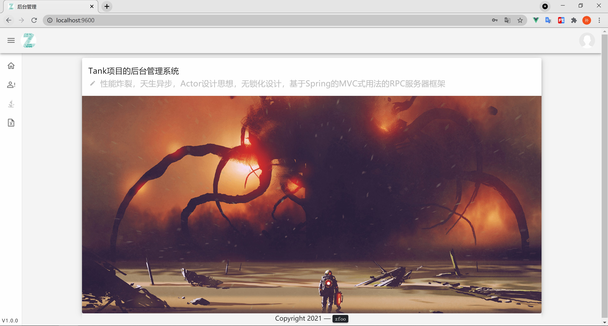
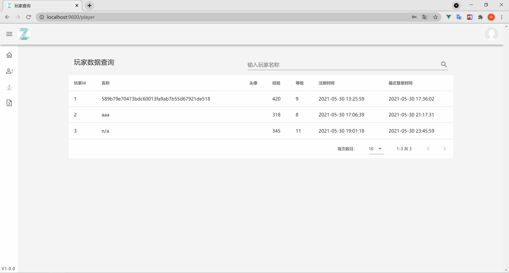
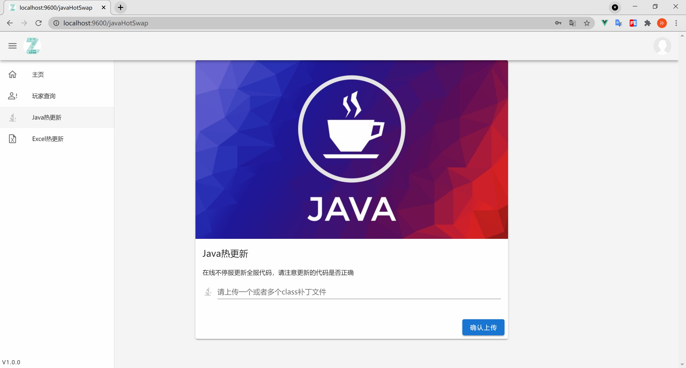
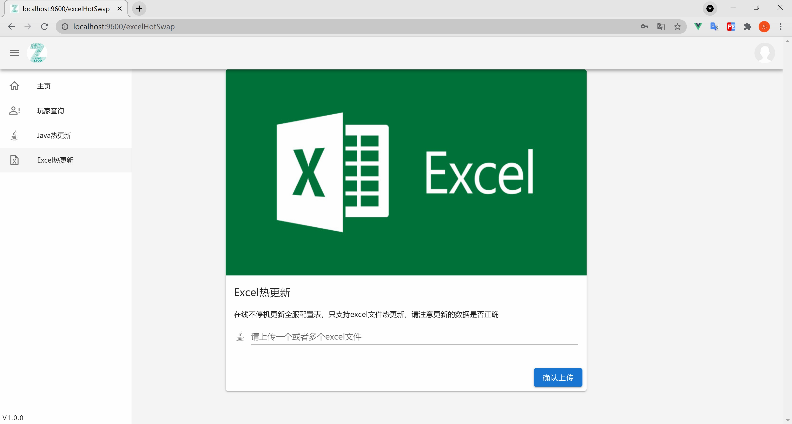
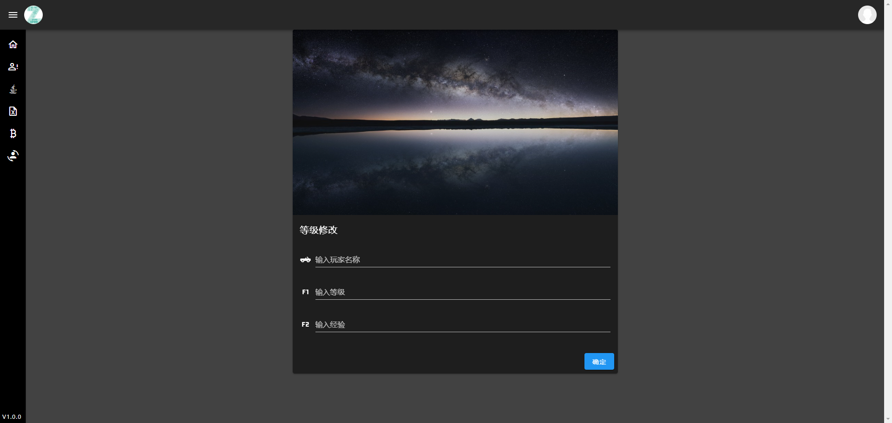

